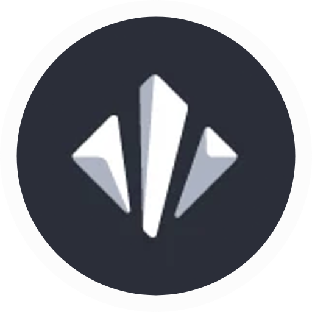

<h1>Nex</h1>
<h3>The 🌐 browser of the 30th Century with built-in Tor 🧅</h3>

---

 
# About

**Nex Browser**. An browser which is all time incognito mode with some special abilities like tor to remain secure and private, with a minimal design. 

## Features

|  | Nex Browser |
| - | ------------ |
| 🕵️ | **Always Incognito**  |
| 🧅 | **Built-in Onion Routing**  |
| 🚫 | **Built-in Ad Blocker**  |
| 🎨 | **Minimalist Interface** |
| 🛡️ | **Sandboxed**  |
| 🆓 | **Always free** |
| 👐 | **Open-source**  |
| 🖥️ | **Multiplatform** |
 

## Platforms

OS | Latest version | Comment |
---|---|--
[Linux](https://github.com/tesseract-org/Nex/releases/latest) |  | Waiting for more peer reviews | [
[Windows](https://github.com/tesseract-org/Nex/releases/latest) |  | Stable | [
[MacOS](https://github.com/tesseract-org/Nex/releases/latest) |  | Waiting for more peer reviews | 

## To-Do
[-] Discord RPC
[-] Custom Search Engine Fix
[-] fix Onion not launching every time

## Build Instructions

-   Clone the repository and install required npm modules
-   Install electron  `npm install electron --save-dev`.
-   Place the tor binary inside resources folder. If you are using Windows, tor binary is directly available at the tor website. You have to manually build tor if you are using Mac/Linux. Follow  [this link](https://www.torproject.org/download/tor/)  to get the tor source code. Build instructions are available  [here](https://2019.www.torproject.org/docs/tor-doc-unix.html.en).
    -   In Windows, place tor executable at ./resources/win/Tor/tor.exe
    -   In Mac and Linux, place tor executable at ./resources/lin/tor
-   `npm run electron-dev`  to run Nex browser in developer mode.
-   Refer package.json for npm scripts to build Nex for your platform.
-   Refer the  [github workflow](https://github.com/tesseract-org/Nex/blob/master/.github/workflows/release.yml)  to learn building Nex from source.

## Bugs & Support

🐞 Found a bug in Nex Browser? You can report it by [creating a new issue](https://github.com/tesseract-org/Nex/issues/new? ).

🧭 Need assistance or want to ask a question? You can [start a discussion](https://github.com/tesseract-org/Nex/discussions/new) or [Discord us](https://discord.gg/zBfSCasSnX).

